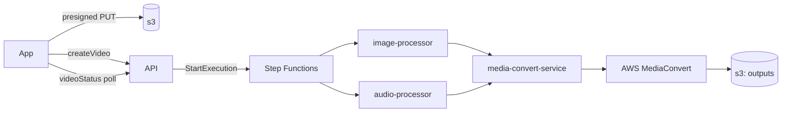

# Chef Hat 👨🏿‍🍳

Chefs up a video when given some audio & an image. 
Audio is dual-passed normalized using ffmpeg's `loudnorm` filter.

- Next.js frontend
- GraphQL API
- Step Functions to normalize audio and resize images in parallel
- AWS MediaConvert to stitch it together

## How it cooks



1. The app fetches presigned URLs and uploads the image and audio assets to S3.
2. Step Function starts executing, we hand back a `trackingId`
   which the app uses to poll.
3. The state machine fans out to `image-processor` (crop + scale to 16:9) and
   `audio-processor` (loudnorm) in parallel. Each lambda downloads from S3, does its
   thing with ffmpeg.
4. `media-convert-service` takes both outputs and assembles a MediaConvert job:
   H.264 at 30fps (QVBR), AAC audio at 96kbps/48kHz, with the still image laid over
   the frame via an `ImageInserter`.
5. MediaConvert uploads the video to our output bucket, client is notified and downloads finished meal.

## Loudnorm, briefly

1. We run `loudnorm` once with `print_format=json` to get the input audio's
  integrated loudness, true peak, loudness range and threshold.
2. We do it AGAIN... feeding those measured values back in as
  `measured_I` / `measured_TP` / `measured_LRA` / `measured_thresh` plus
  `linear=true` to get a silky result.

By default we target: `I=-16 LUFS`, `TP=-1.5 dBTP`, `LRA=11`.

## Local development

You'll need ffmpeg on your `PATH` and AWS credentials for `ap-southeast-2`.

```
pnpm i
pnpm --filter app dev                    # Next.js app on :3000
pnpm --filter @chef-hat/api start        # GraphQL API on :4000
pnpm --filter @chef-hat/audio-processor local   # run loudnorm over local-runner/inputs
pnpm --filter @chef-hat/image-processor local   # same, for image resizing
pnpm --filter @chef-hat/api generate     # regenerate the API's GraphQL types
pnpm --filter app generate               # regenerate the app's GraphQL types
pnpm tidy                                # biome format + lint
```

## Deploying

Running `pnpm build` generates `dist/index.zip` which is the lambda artefact we upload to AWS.
`terraform/` provisions the S3 buckets, the lambda functions and their IAM role.
