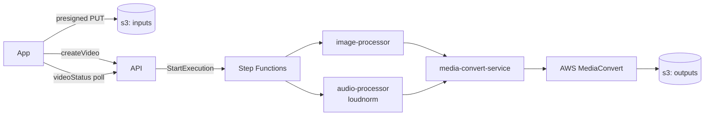

# Chef Hat ᐠ( ᐛ )ᐟ

Hand it a photo and a track, and it plates up a video. The real trick is in the
audio: it gets properly loudness-normalised with ffmpeg's `loudnorm` filter, so it
doesn't come out whisper-quiet or clipping compared to everything else.

Under the hood it's a small serverless kitchen: a Next.js app out front, a GraphQL
API taking orders, and a Step Functions state machine running the line — image prep
and audio normalisation happen in parallel, then AWS MediaConvert plates the final
video.

## How it cooks



1. The app asks the API for presigned URLs and PUTs the image and audio straight to
   the inputs bucket.
2. `createVideo` starts a Step Functions execution, handing back a `trackingId`
   (the execution ARN) the app polls via `videoStatus`.
3. The state machine fans out to `image-processor` (crop + scale to 16:9) and
   `audio-processor` (loudnorm) in parallel. Each lambda downloads from S3, does its
   thing with ffmpeg, and hands the next step an `{ bucket, key }` — the shared
   `S3ObjectState` contract from `lib/step-functions`.
4. `media-convert-service` takes both outputs and assembles a MediaConvert job:
   H.264 at 30fps (QVBR), AAC audio at 96kbps/48kHz, with the still image laid over
   the frame via an `ImageInserter`.
5. MediaConvert renders the video to the outputs bucket. `videoStatus` maps the
   execution's `DescribeExecution` status onto `IN_PROGRESS` / `COMPLETE` / `FAILED`
   until the app can offer a download link.

## Loudnorm, briefly

Two ffmpeg passes, in `packages/audio-processor/src/normalisation/`:

- **Measure** — run `loudnorm` once with `print_format=json` to get the input's
  integrated loudness, true peak, loudness range and threshold.
- **Normalise** — run it again, feeding those measured values back in as
  `measured_I` / `measured_TP` / `measured_LRA` / `measured_thresh` plus
  `linear=true`, so the correction is a single accurate linear pass rather than a
  dynamic one-shot guess.

Targets: `I=-16 LUFS`, `TP=-1.5 dBTP`, `LRA=11`.

## Layout

```
packages/
  app/                    Next.js 15 + React 19 front end (Apollo, zustand, shadcn/ui)
  api/                    Apollo Server — uploadDetails, createVideo, videoStatus
  image-processor/        lambda: crop + scale image to 16:9
  audio-processor/        lambda: loudnorm two-pass audio normalisation
  media-convert-service/  lambda: builds the AWS MediaConvert job
lib/
  s3/                     upload/download helpers shared by the lambdas
  lambda/                 lambda-local filesystem helpers
  step-functions/         shared S3ObjectState / ErrorState types passed between steps
  ts-result/              a small Result<T> type used instead of throwing
  local-runner/           inquirer + figlet CLI for running a processor on local files
  ts-config/              shared tsconfig
terraform/                S3 buckets, lambda functions, IAM
```

## Local development

You'll need ffmpeg on your `PATH` and AWS credentials for `ap-southeast-2`.

```
pnpm i
pnpm --filter app dev                    # Next.js app on :3000
pnpm --filter @chef-hat/api start        # GraphQL API on :4000
pnpm --filter @chef-hat/audio-processor local   # run loudnorm over local-runner/inputs
pnpm --filter @chef-hat/image-processor local   # same, for image resizing
pnpm --filter @chef-hat/api generate     # regenerate the API's GraphQL types
pnpm --filter app generate               # regenerate the app's GraphQL types
pnpm tidy                                # biome format + lint
```

## Deploying

Each lambda package builds to `dist/index.zip` (`pnpm build`, esbuild-bundled).
`terraform/` provisions the input/output/artifact S3 buckets, the lambda functions
and their IAM role.
